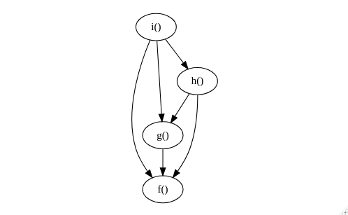

# foodwebr

<!-- badges: start -->
<!-- badges: end -->

foodwebr makes it easy to visualise the dependency graph of a set of functions (i.e. who calls who).
This can be useful for exploring an unfamiliar codebase,or reminding yourself what you wrote ten
minutes ago

## Installation

You can install foodwebr from GitHub:

``` r
devtools::install_github("lewinfox/foodwebr")
```

## Basic usage

Say we have a bunch of functions in the global environment, some of which call each other:

``` r
library(foodwebr)

f <- function() 1
g <- function() f()
h <- function() { f(); g() }
i <- function() { f(); g(); h() }
j <- function() j()
```

A call to `foodweb()` will calculate and display a graph of the dependencies, i.e. who calls who.

``` r
foodweb()
```



Note that function `j()` is not shown because it doesn't interact with any of the other functions.

`foodweb()` looks at the global environment by default. If you want to look at another environment
you can either pass a function to the `FUN` argument of `foodweb()` or pass an environment to the
`env` argument. If `FUN` is provided then the value of `env` is ignored, and the environment of
`FUN` will be used.

You can use this to map all the functions in a package. I'm using `cowsay` here as it's small
enough that the output is readable.

``` r
if (requireNamespace("cowsay", quietly = TRUE)) {
  foodweb(cowsay::say)
}
```


In case you want to do something with the graphvix output (make it prettier, for example), use
`as.text = TRUE`. This returns the graphvis specification as a character vector.

``` r
foodweb(as.text = TRUE)

#> digraph g {
#> "g()" -> { "f()" }
#> "h()" -> { "f()", "g()" }
#> "i()" -> { "f()", "g()", "h()" }
#> }
```

## Digging deeper

foodwebr also exposes the workhorse functions in case you want to play around with them.

### `function_matrix()`

The starting point is to compute the function matrix. This idea, and much of the implementation,
was taken from `mvbutils::foodweb()`. The function matrix is 1 if the function on the y-axis calls
the function on the x-axis, and 0 otherwise. `function_matrix()` looks at functions in the global
environment by default, but you can specify another environment using the `env` argument.

``` r
funmat <- function_matrix()

funmat
#>       CALLEE
#> CALLER f g h i j
#>      f 0 0 0 0 0
#>      g 1 0 0 0 0
#>      h 1 1 0 0 0
#>      i 1 1 1 0 0
#>      j 0 0 0 0 0
```

Note that self-calls are ignored (`funmat["j", "j"]` is zero even though `j()` calls itself).

### `graph_spec_from_matrix()`

The `graph_spec_from_matrix()` function translates the function matrix into a character string
containing a [graphviz](https://graphviz.org/) specification:

``` r
graphvis_spec <- graph_spec_from_matrix(funmat)

graphvis_spec
#> digraph g {
#> "g()" -> { "f()" }
#> "h()" -> { "f()", "g()" }
#> "i()" -> { "f()", "g()", "h()" }
}
```

### Visualisation

We can visualise the graph specification using `Diagrammer::grViz()`.

``` r
DiagrammeR::grViz(graphvis_spec)
```
