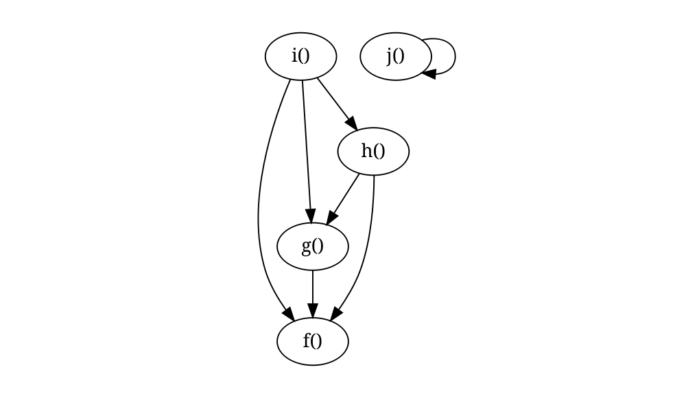
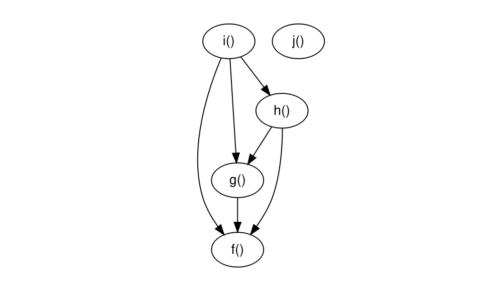

<!-- README.md is generated from README.Rmd. Please edit that file -->

# foodwebr

<!-- badges: start -->
<!-- badges: end -->

`foodwebr` makes it easy to visualise the dependency graph of a set of
functions (i.e. who calls who). This can be useful for exploring an
unfamiliar codebase, or reminding yourself what you wrote ten minutes
ago

## Installation

You can install foodwebr from GitHub:

``` r
devtools::install_github("lewinfox/foodwebr")
```

## Basic usage

Say we have a bunch of functions in the global environment, some of
which call each other:

``` r
library(foodwebr)

f <- function() 1
g <- function() f()
h <- function() { f(); g() }
i <- function() { f(); g(); h() }
j <- function() j()
```

A call to `foodweb()` will calculate a graph of the dependencies,
i.e. who calls who.

``` r
fw <- foodweb()
```

Printing the object will show the graphviz representation:

``` r
fw
#> # A `foodweb`: 5 nodes and 6 edges
#> digraph 'foodweb of <env: 0x55d88853f640>' {
#>   f()
#>   g() -> { f() }
#>   h() -> { f(), g() }
#>   i() -> { f(), g(), h() }
#>   j()
#> }
```

Plotting will draw the graph.

``` r
plot(fw)
```



`foodweb()` looks at the global environment by default. If you want to
look at another environment you can either pass a function to the `FUN`
argument of `foodweb()` or pass an environment to the `env` argument. If
`FUN` is provided then the value of `env` is ignored, and the
environment of `FUN` will be used.

You can use this to map all the functions in a package. I’m using
`cowsay` here as it’s small enough that the output is readable.

``` r
if (requireNamespace("cowsay", quietly = TRUE)) {
  plot(foodweb(cowsay::say))
}
```


In case you want to do something with the
[graphviz](https://graphviz.org/) output (make it prettier, for
example), use `as.text = TRUE`. This returns the graphviz specification
as a character vector.

``` r
foodweb(as.text = TRUE)
#> digraph 'foodweb of <env: 0x55d88853f640>' {
#>   "f()"
#>   "g()" -> { "f()" }
#>   "h()" -> { "f()", "g()" }
#>   "i()" -> { "f()", "g()", "h()" }
#>   "j()"
#> }
```

## Digging deeper

`foodwebr` also exposes the workhorse functions in case you want to play
around with them.

### `function_matrix()`

The starting point is to compute the function matrix. This idea, and
much of the implementation, was taken from
[`mvbutils::foodweb()`](https://rdrr.io/cran/mvbutils/man/foodweb.html).
The function matrix is 1 if the function on the y-axis calls the
function on the x-axis, and 0 otherwise. `function_matrix()` looks at
functions in the global environment by default, but you can specify
another environment using the `env` argument.

``` r
funmat <- function_matrix()

funmat
#>       CALLEE
#> CALLER f g h i j
#>      f 0 0 0 0 0
#>      g 1 0 0 0 0
#>      h 1 1 0 0 0
#>      i 1 1 1 0 0
#>      j 0 0 0 0 0
#> attr(,"class")
#> [1] "foodweb_funmat" "matrix"         "array"
```

Note that self-calls are ignored (`funmat["j", "j"]` is zero even though
`j()` calls itself).

### `graphviz_spec_from_matrix()`

`graphviz_spec_from_matrix()` translates the function matrix into a
character string containing a [graphviz](https://graphviz.org/)
specification:

``` r
graphviz_spec <- graphviz_spec_from_matrix(funmat)

graphviz_spec
#> digraph 'foodweb of foodweb' {
#>   "f()"
#>   "g()" -> { "f()" }
#>   "h()" -> { "f()", "g()" }
#>   "i()" -> { "f()", "g()", "h()" }
#>   "j()"
#> }
```

### Visualisation

We can visualise the graph specification using `Diagrammer::grViz()`.

``` r
DiagrammeR::grViz(graphviz_spec)
```



## Using `tidygraph`

The [`tidygraph`](https://tidygraph.data-imaginist.com/) package
provides tools for graph analysis. A `foodweb` object can be converted
into a tidy graph object using `tidygraph::as_tbl_graph()` to allow more
sophisticated analysis and visualisation.

``` r
if (requireNamespace("tidygraph", quietly = TRUE)) {
  tg <- tidygraph::as_tbl_graph(foodweb())
  tg
}
#> # A tbl_graph: 5 nodes and 6 edges
#> #
#> # A directed acyclic simple graph with 2 components
#> #
#> # Node Data: 5 x 1 (active)
#>   name 
#>   <chr>
#> 1 f    
#> 2 g    
#> 3 h    
#> 4 i    
#> 5 j    
#> #
#> # Edge Data: 6 x 2
#>    from    to
#>   <int> <int>
#> 1     2     1
#> 2     3     1
#> 3     3     2
#> # … with 3 more rows
```
