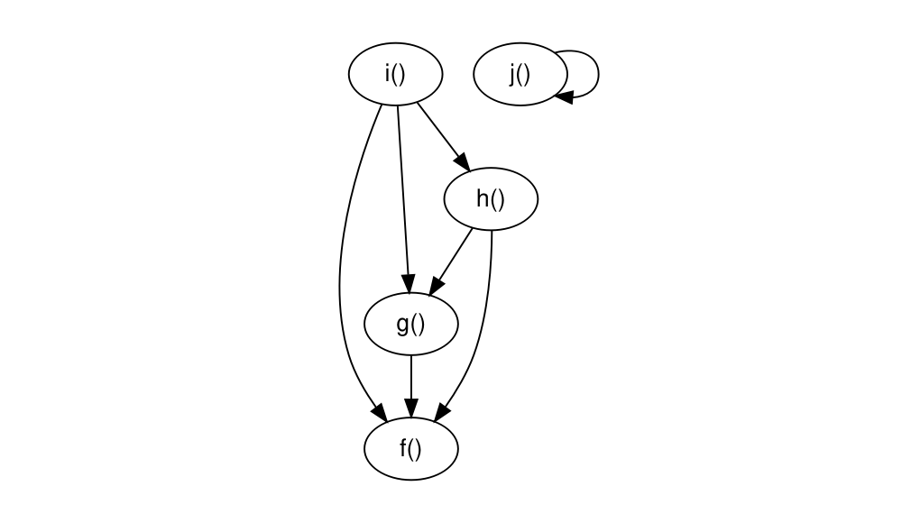
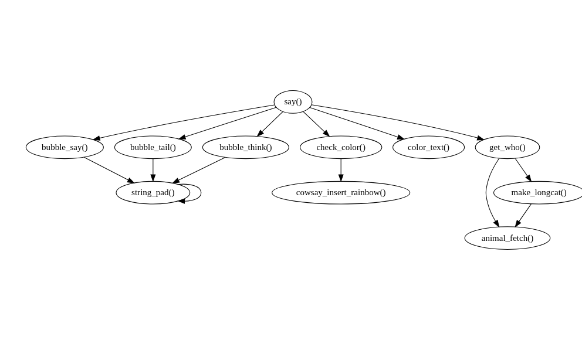
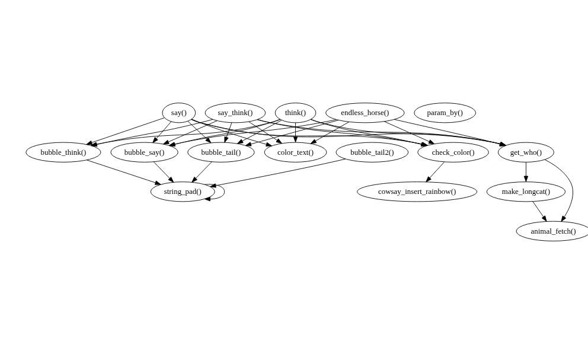

<!-- README.md is generated from README.Rmd. Please edit that file -->

# foodwebr

<!-- badges: start -->

[](https://github.com/lewinfox/foodwebr/actions/workflows/R-CMD-check.yaml)
<!-- badges: end -->

`foodwebr` makes it easy to visualise the dependency graph of a set of
functions (i.e. who calls who). This can be useful for exploring an
unfamiliar codebase, or reminding yourself what you wrote ten minutes
ago

## Installation

You can install foodwebr from CRAN:

``` r
install.packages("foodwebr")
```

or from GitHub:

``` r
devtools::install_github("lewinfox/foodwebr")
```

## Basic usage

Say we have a bunch of functions in the global environment, some of
which call each other:

``` r
library(foodwebr)

f <- function() 1
g <- function() f()
h <- function() {
  f()
  g()
}
i <- function() {
  f()
  g()
  h()
}
j <- function() j()
```

A call to `foodweb()` will calculate a graph of the dependencies.

``` r
fw <- foodweb()
```

Printing the object will show the [graphviz](https://graphviz.org/)
representation:

``` r
fw
#> # A `foodweb`: 5 vertices and 7 edges 
#> digraph 'foodweb' {
#>   f()
#>   g() -> { f() }
#>   h() -> { f(), g() }
#>   i() -> { f(), g(), h() }
#>   j() -> { j() }
#> }
```

Plotting will draw the graph.

``` r
plot(fw)
```



`foodweb()` looks at its calling environment by default. If you want to
look at another environment you can either pass a function to the `FUN`
argument of `foodweb()` or pass an environment to the `env` argument. If
`FUN` is provided then the value of `env` is ignored, and the
environment of `FUN` will be used.

### Filtering

If a specific function is passed to `FUN`, the default behaviour is to
remove functions that are not descendants or antecedents of that
function.

``` r
# `j()` will not be included
foodweb(FUN = g)
#> # A `foodweb`: 4 vertices and 6 edges 
#> digraph 'foodweb' {
#>   g() -> { f() }
#>   h() -> { g(), f() }
#>   i() -> { g(), h(), f() }
#>   f()
#> }

# Force inclusion of unconnected functions by using `filter = FALSE`
foodweb(FUN = g, filter = FALSE)
#> # A `foodweb`: 5 vertices and 7 edges 
#> digraph 'foodweb' {
#>   f()
#>   g() -> { f() }
#>   h() -> { f(), g() }
#>   i() -> { f(), g(), h() }
#>   j() -> { j() }
#> }
```

You can use this feature when exploring code in other packages: calling
`foodweb()` on a function in another package will show you how functions
in that package relate to each other. I’m using `cowsay` here as it’s
small enough that the output is readable.

By default when calling `foodweb()` on a specific function we only see
functions that are in the direct line of descendants or antecendents of
the specified function.

``` r
if (requireNamespace("cowsay", quietly = TRUE)) {
  plot(foodweb(cowsay::say))
}
```



If we want to include *all* functions in the package, we can pass
`filter = FALSE`:

``` r
if (requireNamespace("cowsay", quietly = TRUE)) {
  plot(foodweb(cowsay::say, filter = FALSE))
}
```



### Extra `graphviz` options

In case you want to do something with the
[graphviz](https://graphviz.org/) output (make it prettier, for
example), you can pass additional arguments to `plot()`. These will be
passed directly to `DiagrammeR::grViz()`.

### Foodweb as text

``` r
foodweb(as.text = TRUE)
#> digraph 'foodweb' {
#>   "f()"
#>   "g()" -> { "f()" }
#>   "h()" -> { "f()", "g()" }
#>   "i()" -> { "f()", "g()", "h()" }
#>   "j()" -> { "j()" }
#> }
```

Calling `as.character()` on a `foodweb` object will have the same
effect.

### Functions passed as arguments

Functions don’t always call each other directly. They may be passed as
arguments to other functions, like `do.call()` or `lapply()`.
`foodweb()` recognises this for:

- `do.call()` and `match.fun()`
- The `lapply()` family: `sapply()`, `vapply()`, `mapply()`, `Map()`,
  `Reduce()`, `Filter()`, `Find()`, `Position()`, `apply()`, `tapply()`,
  `outer()`, `rapply()` and `eapply()`
- [`purrr`](https://purrr.tidyverse.org/): `map()` and its variants,
  `reduce()`, `keep()`, `discard()`, `detect()`, `safely()`, `partial()`
  and friends, and `exec()` (also from `rlang`)

``` r
local({
  k <- function(x) x
  l <- function(x) lapply(x, k)
  m <- function() do.call("k", list(1))
  n <- function(x) purrr::map(x, ~ k(.x))
  foodweb()
})
#> # A `foodweb`: 4 vertices and 3 edges 
#> digraph 'foodweb' {
#>   k()
#>   l() -> { k() }
#>   m() -> { k() }
#>   n() -> { k() }
#> }
```

The function can be passed as a bare name (`lapply(x, k)`), a string
(`do.call("k", ...)`), or, for `purrr`, a formula (`map(x, ~ k(.x))`).
Piping with `%>%` or `|>` works too. In `purrr` a string means “extract
this element”, not “call this function”, so `map(x, "k")` is not
counted.

Some things can’t be detected, such as a function name stored in a
variable (`fn <- "k"; do.call(fn, ...)`), because the name is only known
at runtime.

If you’d like `foodweb()` to recognise functions from another package,
please [open an issue](https://github.com/lewinfox/foodwebr/issues).

## Using `tidygraph`

The [`tidygraph`](https://tidygraph.data-imaginist.com/) package
provides tools for graph analysis. A `foodweb` object can be converted
into a tidy graph object using `tidygraph::as_tbl_graph()` to allow more
sophisticated analysis and visualisation.

``` r
if (requireNamespace("tidygraph", quietly = TRUE)) {
  tg <- tidygraph::as_tbl_graph(foodweb())
  tg
}
#> # A tbl_graph: 5 nodes and 7 edges
#> #
#> # A directed multigraph with 2 components
#> #
#> # Node Data: 5 × 1 (active)
#>   name 
#>   <chr>
#> 1 f    
#> 2 g    
#> 3 h    
#> 4 i    
#> 5 j    
#> #
#> # Edge Data: 7 × 2
#>    from    to
#>   <int> <int>
#> 1     2     1
#> 2     3     1
#> 3     3     2
#> # ℹ 4 more rows
```

## See also

`foodwebr` is similar to these functions/packages:

- [`mvbutils::foodweb()`](https://cran.r-project.org/package=mvbutils):
  The OG of function dependency graphs in R, and the inspiration for
  foodwebr. Less user-friendly output, in my opinion.
- [`DependenciesGraphs`](https://github.com/datastorm-open/DependenciesGraphs):
  Provides much nicer visualisations but does not appear to be actively
  maintained.
